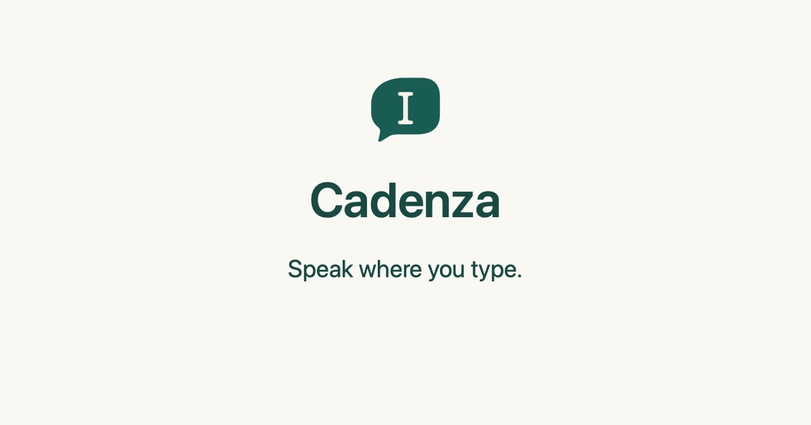

<p align="center">
  
</p>

# Cadenza · 随言

**Speak where you type.** Open-source voice typing for macOS that runs on your Mac.

[简体中文](README.zh-CN.md) · [Website and documentation](https://dragonkingio.github.io/cadenza-site/)

<!-- Intro video (15 s, English): put the GitHub-hosted video URL on its own line here. Never commit the MP4 (cadenza/docs/MEDIA.md). -->

Hold a shortcut, speak, release. Cadenza recognizes your speech and types the text where your cursor is. By default
recognition happens **on this Mac** with a local model; nothing is uploaded unless you choose a cloud service and agree to
it. If the text cannot be typed, the app keeps it so you can copy it.

> **Status: early development.** It works day to day on the maintainer's Mac, but it has not been tested on many setups.
> Compatibility with every app is not verified. Bug reports are very welcome.

## Why Cadenza

- **Your audio, your choice.** Many voice input services upload every recording to the vendor's servers. Cadenza is open
  source, so you can read exactly what leaves your Mac, and you decide where recognition happens: a local model (nothing is
  uploaded) or a cloud service of your own. No account, no server, no analytics, no crash reporting. Cloud services receive
  audio only after your explicit consent for that provider, and their keys live in the macOS Keychain. A "never go online"
  switch hides everything that could connect.
- **Local models you can compare.** SenseVoice (recommended), FireRedASR2 and Parakeet run through
  [sherpa-onnx](https://github.com/k2-fsa/sherpa-onnx), downloaded inside the app with checksum verification. "Compare
  models with my voice" lets you pick the one that suits your voice. Recordings stay in memory.
- **Bring your own cloud service, optionally.** iFLYTEK, Volcengine, Tencent Cloud, Alibaba Cloud, Baidu and Deepgram, with
  your own credentials. When the network fails, recognition can continue with a local model.
- **Screenshots and text recognition** (new, still being tested). Capture an area, mark it up or pin it on screen, and copy
  the text or QR code inside. Apple Vision recognizes the text on your Mac by default; Baidu, Tencent Cloud and Google Cloud
  Vision are optional, with your own keys and consent. See [Screenshot and text recognition](cadenza/docs/SCREENSHOT.md).
- **Built for developers and AI hardware.** An optional, off-by-default API on `127.0.0.1` lets a program or your own
  pendant, glasses, recorder or DIY board start a recording, send audio and receive text, and, if you allow it, type the
  result into the front app. Every device gets its own revocable token with separate permissions. See
  [Local API](cadenza/docs/LOCAL-API.md) and [hardware integration](cadenza/docs/HARDWARE-INTEGRATION.md).
- **Open and measured.** Accuracy changes are justified with a repeatable benchmark ([ACCURACY.md](cadenza/docs/ACCURACY.md)).
- English and Simplified Chinese interface.

## Install

There is no release yet. Build it yourself; it takes a few minutes and needs macOS 26 on Apple silicon with the Xcode
Command Line Tools:

```sh
git clone https://github.com/DragonKingIO/Cadenza-voice.git && cd Cadenza-voice
./cadenza/tools/fetch-sherpa-onnx.sh     # optional: the library for local models
./cadenza/build.sh --stage-only          # creates cadenza/build/stage.noindex/Cadenza.app.zip
```

Unzip it and open the app. A copy you built yourself opens normally. Releases you download are signed ad hoc and not
notarized, so macOS blocks the first launch: open System Settings → Privacy & Security, scroll to the message about the app and
choose **Open Anyway** (since macOS 15, right-click → Open no longer bypasses this). Because each ad hoc build is a new
identity, macOS asks again for the permissions below after you rebuild or update. Full instructions:
[Developing Cadenza](cadenza/docs/DEVELOPING.md).

**Platforms:** macOS 26 or later on Apple silicon only. See [Platforms](cadenza/docs/PLATFORMS.md) for why, and what could be
reused for a port.

| Permission | Why |
|---|---|
| Microphone | Capture speech while you record |
| Accessibility | Find the text field and type the result |
| Input Monitoring | Detect the global shortcut |
| Speech Recognition | Only if you use Apple's built-in recognition |
| Screen & System Audio Recording | Only for screenshots |

## What is and is not verified

Local recognition with SenseVoice is exercised with a benchmark and in daily use. Cloud providers other than iFLYTEK and
Deepgram have only been tested with fake transports, and iFLYTEK and Deepgram only with synthesized speech. A protocol
implementation does not promise that your account, region or plan will work. Provider names are descriptive labels, not
endorsements, and Cadenza is not affiliated with them.

## Privacy

Read the [privacy notice](cadenza/PRIVACY.md) and [terms](cadenza/TERMS.md). Logs hold state, errors and text lengths; the
code does not write audio or transcripts to them, and you can turn logging off.

## Contributing

Everyone is welcome: code, documentation, model evaluations on your own voice, and bug reports. Start with
[CONTRIBUTING.md](CONTRIBUTING.md) and the [development guide](cadenza/docs/DEVELOPING.md). Please follow the
[Code of Conduct](CODE_OF_CONDUCT.md), and report security problems privately as described in [SECURITY.md](SECURITY.md).
Naming rules are in [BRAND.md](BRAND.md).

## License

[MIT](cadenza/LICENSE). Third-party components and models are listed in
[THIRD_PARTY_NOTICES.md](cadenza/THIRD_PARTY_NOTICES.md).
