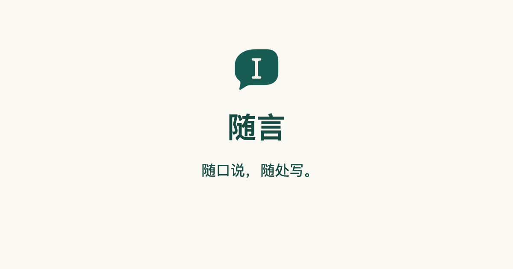

<p align="center">
  
</p>

<p align="center">
  <b>随口说，随处写。</b><br>
  开源的 macOS 语音输入，识别在你的 Mac 上完成。
</p>

<p align="center">
  <a href="https://dragonkingio.github.io/cadenza-site/zh-cn/">官网</a> ·
  <a href="https://dragonkingio.github.io/cadenza-site/zh-cn/getting-started/">文档</a> ·
  <a href="https://dragonkingio.github.io/cadenza-site/zh-cn/download/">下载</a> ·
  <a href="README.md">English</a>
</p>

<p align="center">
  
  
  
  
</p>

https://github.com/user-attachments/assets/a60e81d9-32d2-4f48-a59d-9e9d79568d2f

按住一个键（默认左 Option）说话，松开，文字就出现在光标处。很多语音输入服务会把你的每段录音上传到厂商的服务器；随言默认在你的 Mac 上识别，而且是开源的，什么会离开这台 Mac，谁都可以查。

## 功能

- **默认本地识别。** SenseVoice（推荐）、FireRedASR2、Parakeet 通过 [sherpa-onnx](https://github.com/k2-fsa/sherpa-onnx) 在你的 Mac 上运行，在应用内下载并校验。“用我的声音比较模型”告诉你哪个最听得懂你。
- **想用云端，用你自己的账号。** 讯飞、火山引擎、腾讯云、阿里云、百度、Deepgram，使用你自己的密钥；只有你对该服务商同意之后才会发送音频。网络出问题时可以由本地模型接着识别。
- **截图与文字识别**（新功能，仍在测试）。框选截图、标注、贴在屏幕上，一键取出图里的文字和二维码。默认用 Mac 自带的 Apple Vision 在本机识别。[详情](cadenza/docs/SCREENSHOT.md)（英文）
- **接入开发者和 AI 硬件。** 可选的本地接口，只监听 `127.0.0.1`、默认关闭，让你的程序、挂件或眼镜发送音频、取回文字；每个设备有自己的、可随时撤销的令牌。[本地接口](cadenza/docs/LOCAL-API.md) · [硬件接入](cadenza/docs/HARDWARE-INTEGRATION.md)（英文）
- **隐私是设计前提。** 没有账号、没有服务器、没有统计、没有崩溃上报。录音和识别文字不写入磁盘和日志，密钥存放在 macOS 钥匙串。“永不联网”开关会隐藏一切可能联网的选项。
- **可度量。** 识别效果的改动都用可重复的基准来证明。[准确度](cadenza/docs/ACCURACY.md)（英文）

## 开始使用

目前还没有发布版本，需要自己构建，几分钟即可。要求 macOS 26 及以上、Apple 芯片，并安装 Xcode 命令行工具（`xcode-select --install`）。

```sh
git clone https://github.com/DragonKingIO/Cadenza-voice.git && cd Cadenza-voice
./cadenza/tools/fetch-sherpa-onnx.sh     # 本地模型需要的推理库
./cadenza/build.sh --stage-only          # 生成 cadenza/build/stage.noindex/Cadenza.app.zip
```

解压后打开应用，按提示允许这些权限：

| 权限 | 用途 |
|---|---|
| 麦克风 | 录音时采集你的声音 |
| 辅助功能 | 把识别结果写入输入框 |
| 输入监控 | 检测全局快捷键 |
| 语音识别 | 仅在使用 Apple 自带识别时需要 |
| 录屏与系统录音 | 仅截图时需要 |

自己构建的副本可以直接打开。之后的发布版是临时签名、**没有公证**（项目没有预算购买 Apple 开发者证书），所以下载的副本第一次打开会被 macOS 拦截：到 系统设置 → 隐私与安全性，点“仍要打开”。下一步：[快速开始](https://dragonkingio.github.io/cadenza-site/zh-cn/getting-started/) · [开发指南](cadenza/docs/DEVELOPING.md)（英文）。

## 状态

早期预览。维护者每天都在用，但还没在很多环境里测试过，也没有验证所有应用的兼容性。SenseVoice 本地识别有基准测试，也在日常使用。云端服务里，讯飞和 Deepgram 用合成语音联网测试过，其余只用假的网络层测试过。服务商名称只是描述，不代表背书，随言与它们没有关联。只支持 macOS（[原因](cadenza/docs/PLATFORMS.md)，英文），欢迎另起项目移植。

## 参与贡献

欢迎代码、文档、翻译、用自己声音做的模型评测和问题反馈。从 [CONTRIBUTING.md](CONTRIBUTING.md) 开始；每个改动都会按其中的隐私约定评审。请遵守[行为准则](CODE_OF_CONDUCT.md)，安全问题请按 [SECURITY.md](SECURITY.md) 私下报告。

## 许可证

[MIT](cadenza/LICENSE)。[隐私说明](cadenza/PRIVACY.zh-CN.md) · [使用条款](cadenza/TERMS.zh-CN.md) · [第三方声明](cadenza/THIRD_PARTY_NOTICES.zh-CN.md)
